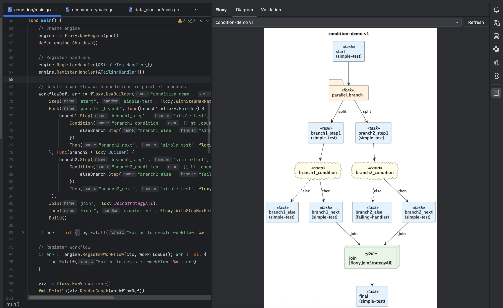

# Floxy Workflow Viewer

**Floxy Workflow Viewer** is a visualization and export plugin for GoLand that renders workflow graphs built with [Floxy](https://github.com/rom8726/floxy) — a lightweight Saga orchestration library for Go.

It helps developers and architects better understand workflow logic, branching, compensation paths, and step dependencies — directly within the IDE.

---

## Features

### Visualization
- Renders workflow diagrams using **PlantUML** and **Mermaid**.
- Automatically detects step types, transitions, forks, joins, and on-failure handlers.
- Supports **human-in-the-loop** steps, **conditional flows**, and **parallel branches**.

### Export
- Export diagrams as **.puml** or **.mmd**.
- For PlantUML, you can also export rendered **SVG** or **PNG** images.
- All exports work entirely **offline** — no external rendering servers required.

### Smart Representation
- Recognizes `SavePoint`, `Condition`, `Fork`, `Join`, `Parallel`, `Human` steps.
- Automatically refreshes the diagram when the workflow source changes.
- Highlights compensation relationships and failure-handling paths.



---

## Supported IDEs
- **GoLand** 2025.2 or newer
- Compatible with **Kotlin Runtime 2.2.0+**

---

## Getting Started

1. Install **Floxy Flow Viewer** from [JetBrains Marketplace](https://plugins.jetbrains.com/)
   *(or manually via “Install Plugin from Disk…” and select `floxy-goland-plugin.zip`)*

2. Open a Floxy workflow definition in your code.

3. Open the **Floxy Flow Viewer** tool window to visualize the workflow graph.

4. Optionally export the diagram to `.puml`, `.mmd`, `.svg`, or `.png`.

---

## Development

To build the plugin locally:

```bash
make build
````
The built ZIP file will be available in `build/distributions/`.


To launch unit tests:

```bash
make test
```
